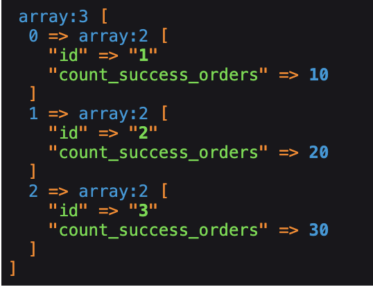

## Codememory Entity response control
#### This library is designed for prototyping the returned array, basically you describe the schema of how and what you want to get in the array. As an example: You have a Doctrine entity and you need to give data to this entity in the API. To do this, you can create a prototype in the form of a class, which will then be converted into an array. You may ask how this is different from symfony/serializer, but the difference is that this library actively uses PHP attributes and you can format your data however you want. In addition, this library can easily handle the task when you need to give in one query not only all entities but also other data of each object, which were received by another SQL/DQL query. Below are some examples

Translated with DeepL.com (free version)

### Install
```shell 
$ composer require codememory/entity-response-control
```

### Manager creation

```php
use Codememory\EntityResponseControl\ResponsePrototypeManager;
use Codememory\Reflection\ReflectorManager;
use Symfony\Component\Cache\Adapter\FilesystemAdapter;
use Codememory\EntityResponseControl\Factory\PrototypeExecutionContextFactory;
use Codememory\EntityResponseControl\Factory\PropertyWrapperFactory;
use Codememory\EntityResponseControl\Factory\PropertyExecutionContextFactory;
use Codememory\EntityResponseControl\Collectors\BaseCollector;
use Codememory\EntityResponseControl\DecoratorRegistrar;
use Codememory\EntityResponseControl\NamingStrategy\SnakeCamelNamingStrategy;

$cache = new FilesystemAdapter('codememory', directory: 'cache');
$reflectorManager = new ReflectorManager($cache);
$decoratorRegistrar = new DecoratorRegistrar();

$manager = new ResponsePrototypeManager(
    $reflectorManager,
    new PrototypeExecutionContextFactory(
        new PropertyWrapperFactory()
    ),
    new PropertyExecutionContextFactory(),
    new BaseCollector(
        $decoratorRegistrar,
        new SnakeCamelNamingStrategy()
    ),
    $decoratorRegistrar
);
```

### A simple Example

```php
// Entity
class User {
    .... 
    
    public function getName(): string
    {
        return 'Foo';
    }
    
    public function getSurname(): string
    {
        return 'Bar';
    }
}

// Prototype
class UserPrototype {
    private ?string $name = null; // null - Default value
    private ?string $surname = null; // null - Default value
}

// In order to collect it is necessary to call the collect method
$result = $manager->collect(UserPrototype::class, new User());
```

> [!] Note that if you pass collect as an array of objects as the second argument, the array will be multidimensional, otherwise you will get just an associative array

### Use of decorators

```php
// Entity
use Codememory\EntityResponseControl\Decorators\Property;

class Order {
    public function __construct(
        private string $name
    ) {}
    
    public function getName(): string 
    {
        return $this->name;
    }
}

class User {   
    public function getOrders(): array
    {
        return [
            new Order('Order 1'),
            new Order('Order 2'),
            new Order('Order 3')
        ];
    }
    
    public function getSurname(): string
    {
        return 'Bar';
    }
}

// Prototype
class OrderPrototype {
    private ?string $name = null;
}

class UserPrototype {
    #[Property\Getter(['getOrders'])] // Explicitly specify the method to use, since we don't have a getCountOrders or isCountOrders method
    #[Property\Length]
    private ?int $countOrders = null;
    
    #[Property\Nested(OrderPrototype::class)]
    private array $orders = [];
    private ?string $surname = null;
}

$result = $manager->collect(UserPrototype::class, new User());
```


#### Let's imagine that we have users, and statistics on users is considered in a separate query and we need to somehow combine all this data in one query

```php
use Codememory\EntityResponseControl\Decorators\Property;

class User {
    public function __construct(
        private string $id,
        private string $name
    ) {}
    
    public function getId(): string
    {
        return $this->id;
    }
    
    public function getName(): string
    {
        return $this->name;
    }
}

$users = [
    new User('1', 'User 1'),
    new User('2', 'User 2'),
    new User('3', 'User 3')
];

$metadata = [
    'success_orders' => [
        '1' => 10,
        '2' => 20,
        '3' => 30
    ]
];

class UserPrototype {
    private ?string $id = null;
    
    // As the first argument it is necessary to pass the name of the getter, in our case the unique value of the user is his identifier
    // The second argument is to pass the key from where to take values from metadata
    #[Property\FromObjectMetadata('getId', 'success_orders')]
    private ?int $countSuccessOrders = null;
}

$result = $manager->collect(UserPrototype::class, $users, metadata: $metadata);
```



> You can also pass metadata not directly to the manager, but also use decorators, for example, to pull data using the service

```php
use Codememory\EntityResponseControl\Decorators\Property;
use Codememory\EntityResponseControl\Decorators\Prototype;
use Codememory\EntityResponseControl\Interfaces\PrototypeExecutionContextInterface;

class User {
    public function __construct(
        private string $id,
        private string $name
    ) {}
    
    public function getId(): string
    {
        return $this->id;
    }
    
    public function getName(): string
    {
        return $this->name;
    }
}

class Service {
    public static function getMetadata(PrototypeExecutionContextInterface $executionContext): void
    {
        $executionContext->setMetadata([
            'success_orders' => [
                '1' => 10,
                '2' => 20,
                '3' => 30
            ]
        ]);
    }
}

$users = [
    new User('1', 'User 1'),
    new User('2', 'User 2'),
    new User('3', 'User 3')
];

#[Prototype\Callback([Service::class, 'getMetadata'])]
class UserPrototype {
    private ?string $id = null;

    #[Property\FromObjectMetadata('getId', 'success_orders')]
    private ?int $countSuccessOrders = null;
}

// The result will be the same as in the last example.
$result = $manager->collect(UserPrototype::class, $users);
```